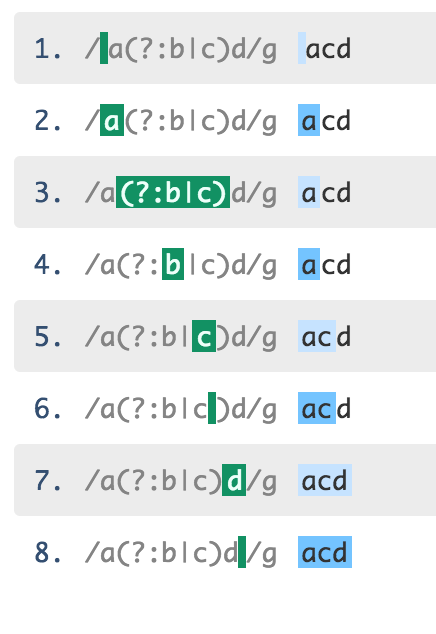
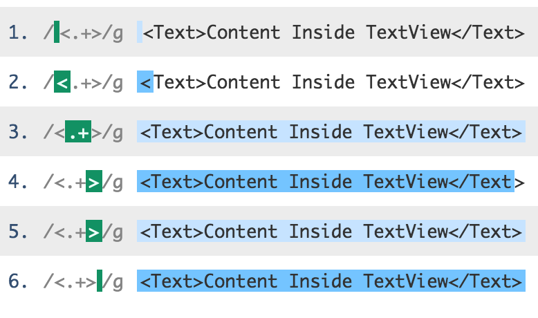
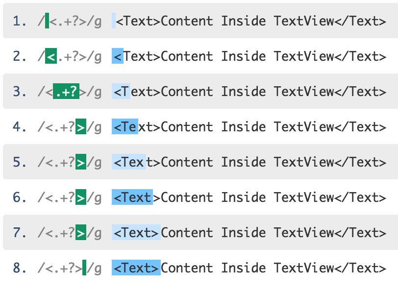
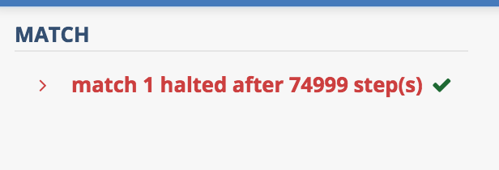

## Regexes and Python

What are regular expressions? 

Regular expressions are a concise way to describe a string or a group or strings. 
They are a shorthand, and as shorthands go, they have their own syntax.

A simple regex looks like this 
```
Regex to match english letters in both, lower and uppercase

Regex   -  [a-zA-Z]+
String  -  "Apple"
Matches -  ["Apple"]
```

A bit more involved, but comprehensible, regex looks like this
```
Regex to match hashtags in a string

Regex   -  #[a-zA-Z0-9\-_]+
String  -  "I need #help, please. #Thanks"
Matches -  ["#help", "#Thanks"]
```
[Source](http://stackoverflow.com/a/21651362/1518924)

While an insane regex looks like this 
```
Match strings surrounded by quotes that are not properties of an html tag

Regex   -  \"([^<>]*?)\"(?=(?:[^>]*?(?:<|$)))
String  -  "<p>This is a "wonderful text" <a href="site-to-nowhere.com" target="_blank">link</a>.</p>"
Matches -  ['"wonderful text"']
```
[Source](http://stackoverflow.com/a/22589854/1518924)

### Regexes in Python
Regexes come in many flavors. By that, I mean they have different regex engines. The regex engine is the piece of code that basically evaluates a string against a regex. There are many differences in the various regex flavors. The ones that we, as people who use them, need to be concerned about are regarding the feature set and the syntax that the engine has to offer.

Some of the regex flavors are - PCRE (Perl Compatible Regular Expressions), POSIX, POSIX ERE, .NET, JavaScript etc. Many individual programming languages have become a regex flavor of their own because of the differences in the implementation of their regex engines and what they do and do not support. Python's regex is it's own flavor :). There are also exceptions to that, like PHP, whose regex engine is a wrapper around PCRE, which is written in C.

Regexes contain characters that have special meaning to them. Characters like `\` in `\d` shorthand character class(which matches a digit) are essential to the semantics of a regex. If we use them similar to the way we use strings (i.e enclosing them in double/single quotes) in python, they'll be treated as escape sequences. To use a backslash inside a string as a regex, we'll need to add two backslashes, `"\\d"`. A simpler solution is to use raw strings for regexes. In raw strings, the backslashes are not treated as a special character.

So a regex in python may be written as - 
```python
regex = r'\d+'
```

In python, the `re` module exposes methods which are useful in processing strings using regexes.
Their [documentation](https://docs.python.org/3/library/re.html) is pretty much straight-forward and enlists what the module can do.

Here is a list of functions that I commonly use. Refer to the [documentation](https://docs.python.org/3/library/re.html) here for more methods that `re` supports.

#### Search

`re.search(pattern, string, flags=0)`

It searches the input string for the first location of a match against a regex. It stops after that. It returns a `match` object which basically stores information about the current match. You can fetch useful information like the starting or ending index of the match, fetch part of the match corresponding to the capturing group by calling the appropriate `match` methods. You can read more about `match` [here](https://docs.python.org/3/library/re.html#match-objects)

```python
In [X]: import re
In [X]: ip_str = '''It is an ancient Mariner,
   ...: And he stoppeth one of three.
   ...: 'By thy long grey beard and glittering eye,
   ...: Now wherefore stopp'st thou me?
   ...:
   ...: The Bridegroom's doors are opened wide,
   ...: And I am next of kin;
   ...: The guests are met, the feast is set:
   ...: May'st hear the merry din.'''

In [X]: regex = re.compile(r'\b[a-zA-Z]+e\b')

In [X]: match_obj = regex.search(ip_str)

In [X]: match_obj.group()
Out[X]: 'he'
```
You can use compile if you think the regex is going to be used again.
It's more efficient that way since everytime you need to match something against a regex, 
a Regular Expression object will be created. 

Note that even without using compile, `re` module caches the last used regex anyway, so creating them repeatedly should be fine I guess :) 
[Source](http://stackoverflow.com/a/452143/1518924)

#### Findall

`re.findall(pattern, string, flags=0)`

This method basically finds all the non-overlapping matches in a string starting from left to right and returns a list of strings matched. Be careful when using this with multiple capturing groups, where it returns a list of tuples of the captured groups.

```python
In [X]: regex.findall(ip_str)
Out[X]:
['he',
 'one',
 'three',
 'eye',
 'wherefore',
 'me',
 'The',
 'are',
 'wide',
 'The',
 'are',
 'the',
 'the']
```

#### Finditer

`re.finditer(pattern, string, flags=0)`

If your regex is really complicated or if your string is really long or your requirements involve checking every string as they're matched one by one, then `finditer` is a good substitute for `findall`. It basically returns just an iterator, which can be called repeatedly until all the matches are exhausted. Using this is usually a lot more prudent when you need to save time or debug :)

```python
# It just returns an iterator
In [X]: match_iter = regex.finditer(ip_str)
In [X]: [val.group() for val in match_iter]
Out[X]:
['he',
 'one',
 'three',
 'eye',
 'wherefore',
 'me',
 'The',
 'are',
 'wide',
 'The',
 'are',
 'the',
 'the']
```

#### Split

`re.split(pattern, string, maxsplit=0, flags=0)`

This method is used to split the string based on a regex. It returns a list of strings just like how a string split would work.

```python
In [X]: re.split(r"[',.;]", ip_str)
Out[X]:
['It is an ancient Mariner',
 ' \nAnd he stoppeth one of three',
 ' \n',
 'By thy long grey beard and glittering eye',
 ' \nNow wherefore stopp',
 'st thou me? \n\nThe Bridegroom',
 's doors are opened wide',
 ' \nAnd I am next of kin',
 ' \nThe guests are met',
 ' the feast is set: \nMay',
 'st hear the merry din',
 '']
 ```

This is just a sanitized version of the previous string where empty values are removed

```python
# The ugly way :p 
# "\n".join([m.strip() for m in re.split(r"[',.;]",ip_str) if m.strip())])

In [X]: for m in re.split(r"[',.;]",ip_str):
    ...:     val = m.strip()
    ...:     if val: print(val)
    ...:
It is an ancient Mariner
And he stoppeth one of three
By thy long grey beard and glittering eye
Now wherefore stopp
st thou me?

The Bridegroom
s doors are opened wide
And I am next of kin
The guests are met
the feast is set:
May
st hear the merry din
```

Since you are using a regex to split, sometimes you will need the split-string(by that, I mean the pattern that is used to split) to also be produced in the output.
Using capturing groups, enables that. The splitting string is found between the matches. In case a splitting string is matched at the beginning of the input string, an empty string is the first element in the output.

Moral of the story: Always sanitize your split outputs else you will have hell to pay :p

Here's a simple example that demonstrates that - 

```python
# Split the input strings by `_number_` and also fetch the numbers
In [X]: keycodes_str = "abcd_123_efgh_456_ijkl"

In [X]: re.split(r'_([0-9]+)_', keycodes_str)
Out[X]: ['abcd', '123', 'efgh', '456', 'ijkl']
```

#### Sub 

`re.sub(pattern, repl, string, count=0, flags=0)`

This method is used for finding a string that matches a regex and then substituting it.

```python
In [X]: print(re.sub(r'thy', "your", ip_str))
It is an ancient Mariner,
And he stoppeth one of three.
'By your long grey beard and glittering eye,
Now wherefore stopp'st thou me?

The Bridegroom's doors are opened wide,
And I am next of kin;
The guests are met, the feast is set:
May'st hear the merry din.
```

The `sub` method also has this nice feature where instead of using the replacement string, you can pass a callback method that accepts a `match` object, which will return a replacement string. This is useful when you want to perform some kind of logic-based replacement.

```python
# This is basically replacing all the archaic pronouns into modern ones

In [X]: def archaic_pronoun_conv(m_str):
    ...:     val = m_str.group().lower()
    ...:     if val == "thy":return "your"
    ...:     if val == "thou":return "you"
    ...:     if val == "may'st":return "may"
    ...:     return val
    ...:

In [X]: new_str = re.sub(r'thy|thou|May\'st', archaic_pronoun_conv, ip_str)

In [X]: print(new_str)
It is an ancient Mariner,
And he stoppeth one of three.
'By your long grey beard and glittering eye,
Now wherefore stopp'st you me?

The Bridegroom's doors are opened wide,
And I am next of kin;
The guests are met, the feast is set:
may hear the merry din.
```

All of the above methods have an optional argument called flags. The `re` module has some flags which basically modifies how a regex engines searches for a match against a regex pattern. For example, using `re.I` or `re.IGNORECASE` will make the regex matching process case-insensitive. You can refer to a list of all the flags from their [documentation](https://docs.python.org/3/library/re.html#re.A). You can use multiple flags in python by bitwise OR-ing them.

### Grouping 
Grouping is where you want to group a bunch of regex tokens into one logical unit. You usually want to do that when you need to specify an operation on the whole group (like a quantifier - `+`, `*` or `?`) or have a common functionality outside the group. For this purpose, you would basically use a non-capturing group denoted by `(?:)`.

```python
# We want to match "andaas", "patiees"

# Without grouping of any kind, the regex is pretty hard to comprehend
In [X]: re.findall(r'\w+a+s|\w+e+s', "andaas and patees")
Out[X]: ['andaas', 'patees']

# With grouping 
In [X]: re.findall(r'\w+(?:a+|e+)s', "andaas and patees")
Out[X]: ['andaas', 'patees']
```

Python has another type of grouping called capturing groups. These basically allow you to sub-group your regular expression.

In a regex match suppose you want to fetch only a part of the match from the result.
For example - 

```python
In [X]: ip_str = '''in [1] : print(x)
    ...: out [1] : "Coming back to Life"
    ...:
    ...: in [2] : print(y)
    ...: out [2] : "Spit out the bone"'''

# Supposing we want to match the "out" string

# The regex is just for representational purposes. I know it's not efficient.
In [X]: re.findall(r'out.*?".*?"', ip_str)
Out[X]: ['out [1] : "Coming back to Life"', 'out [2] : "Spit out the bone"']
```
Here if you just want the content inside the quotes, you would need to perform some operations in the output.
Instead, a capturing group allows us to basically structure the output so that it's easier for us to fetch whatever we want.

So the solution to the above was just changing the regex

```python
In [X]: re.findall(r'out.*?"(.*?)"', ip_str)
Out[X]: ['Coming back to Life', 'Spit out the bone']
```

If you want both the results then you need to use the `group` method of the `match` object.

```python
In [X]: [m.group(0, 1) for m in re.finditer(r'out.*?"(.*?)"', ip_str)]
Out[X]:
[('out [1] : "Coming back to Life"', 'Coming back to Life'),
 ('out [2] : "Spit out the bone"', 'Spit out the bone')]
```

If you want a generic solution to the above which includes every match and not manually adding `m.group(0, 1)`, then you need to fetch the number of groups a regex has, which can be found out once it's `compile`d. You can then use the [`groups`](https://docs.python.org/3/library/re.html#re.regex.groups) method on the compiled regex B).

```python
In [X]: regex = re.compile(r'out.*?"(.*?)"')

In [X]: [m.group(*(range(regex.groups+1))) for m in regex.finditer(ip_str)]
Out[X]:
[('out [1] : "Coming back to Life"', 'Coming back to Life'),
 ('out [2] : "Spit out the bone"', 'Spit out the bone')]
```

Some interesting information and notes on using capturing groups -
- The indices of the capturing groups are depth first. Even in that, the order is Root, followed by the children (starting from the left-most). [Example here](https://regex101.com/r/X7fCOF/2)
- If there is a quantifier outside the capturing group, like this - `([0-9])+` the capturing group will only contain the last matched element and discard earlier ones. This is called [Repeated Capturing Group](http://www.regular-expressions.info/captureall.html). It's common enough to warrant a mention :p Make sure to use `(\w+)` if you need the whole thing. [Example here](https://regex101.com/r/1DFTOY/1). You can even nest the existing capturing group if you want - `((\w)+)`

### Backtracking

There are basically [two types of regex engines](https://www.calvin.edu/~rpruim/courses/c260/resources/regex/regex.shtml
)
- Text Driven
  - It uses DFA internally. 
  - It's execution is driven by the input string. It has to consider all possible permutations while constructing the DFA, which is traditionally done like this - Regex -> NFA -> DFA
  - It's faster in the sense that there's no backtracking, but, it has more states than an NFA-based regex. It's much more efficient to find a match in this.
  - It cannot support features like backreferences and lookarounds.
  - MySQL, egrep(old)

- Regex Driven - 
  - It uses NFA internally. 
  - It's execution is driven by the regex string.
  - It's considered to be slower than DFA and the performance basically depends on how the regex string is constructed and the path chosen if there are multiple paths.
  - Python, PCRE

Currently there are also hybrids that basically takes the best of both worlds. egrep is one example. That being said, even the so called slower NFA engines are highly optimized and perform staggeringly well for complex inputs.

So let's understand how backtracking basically works.
Alternations are the simplest examples of how backtracking can work. Assume a regex that has alternation - `a(?:b|c)d`. Clearly, input strings `abd` and `acd` are matches to this regex.
Let's understand how it exactly matches the string `acd`.
Here's a demo of how that works  - 



You can see the above in action [here](https://regex101.com/r/JgTaBE/1)

When the control is basically at the b position in `a(?:b|c)d`, the regex fails to match the string. But since, it's an alternation, it backtracks and matches the input string to c, and subsequently to d.

### Greediness and Laziness
Before we get into greediness and laziness, let's understand a few basic things about quantifiers.

Quantifiers are values in regexes that specify the number of times that the token preceding it, can repeat. This feature is primarily responsible for the succinctness of regular expressions, allowing to express really complex constructs in a simple way.

There are different types of quantifiers.
- Conditional - `?`
  - This allows the token preceding it to repeat itself 0 or 1 times. This makes the preceding token optional.
- Star - `*`
  - This allows the token preceding it to repeat itself 0 or more times.
- Plus - `+`
  - This allows the token preceding it to repeat itself 1 or more times.
- Limiting Quantifiers - `{m, n}`
  - This allows the token preceding it to repeat itself atleast `m` times to atmost `n`.
  - If `n` omitted, then it can match as many times as it wants, after atleast matching `m` times.
  
#### Greediness
Greediness is a characteristic of a regex engine to aggresively match tokens for a quantifier, as many times as it is possible. All the quantifiers specified above are greedy by default.

Here is an example that can better explain how greediness works in regexes.
```python
In [X]: ip_str = "<Text>Content Inside TextView</Text>"

In [X]: re.findall(r'<.+>', ip_str)
Out[X]: ['<Text>Content Inside TextView</Text>']
```

I was intending to match only "<Text>", but regex `<.+>`, has the `+` quantifier which is greedy by default. So it will match the whole string(since `.` matches everything) and backtrack backwards until the next token is found.

Here is a pictoral representation of what this means - 





Here is a [demonstration](https://regex101.com/r/ShRp4g/1) of that.

#### Laziness
Laziness, as you may have guessed, tries to match the input string, as less times as possible, that the quantifier can support. A quantifier can be made lazy by adding a `?` after it. 

Here is the output from the same example as mentioned above.

```python
In [X]: ip_str = "<Text>Content Inside TextView</Text>"

In [X]: re.findall(r'<.+?>', ip_str)
Out[X]: ['<Text>', '</Text>']
```

So, just by using `.+?`, we were able to get the match that we want. Here is a detailed representation of how the match is being made - 





Here is a [demo](https://regex101.com/r/ShRp4g/2) of that in action.

Here the `.+?` operator initially matches only 1 element, which is the `T` of the `<Text>`. From then onwards it tries to match `>`. If it fails, it backtracks to the next position(Yes, I realize what I've written) till it finds `>`.

### Horror stories
Although it might seem like the engines are advanced and optimized, in the end it all comes down to how the regex was framed and what input was given.

Using the right type of quantifier(lazy vs greedy) can be especially tricky. If you understood the definitions above, you might've realized that the size of the input string has a huge bearing on the way greedy and lazy backtracking work. 

If the regular expression is convoluted enough, it can lead to something that's called [catastrophic backtracking](http://www.rexegg.com/regex-explosive-quantifiers.html). This usually occurs on regex failures, where the regex engine backtracks many times to match the input string. It's usually because of a mix of multiple quantifiers.

Here is a simple example of `^(A+)*B` matching against the string `AAAAAAAAAC`.
The regex101's [demo](https://regex101.com/r/ShRp4g/3) halts after sometime :)

Their debugger explains a lot - 





This is a [better example](http://stackoverflow.com/a/22235225/1518924) where catastrophic backtracking is the first thing that should be considered :) 

The solution to this is using possesive quantifiers. It's basically similar to lazy quantifiers but instead of adding a `?`, one adds a `+`. It basically prevents the preceding token to be backtracked again. Therefore, that token will never be traversed more than once. Sadly, at this point, `re` does not support it :(

Improper regexes can be notorious, and can lead to disastrous results. Here is an example of a [stackoverflow downtime](http://stackstatus.net/post/147710624694/outage-postmortem-july-20-2016) that happened on july 2016, caused by a freakish user input (lesson: All user inputs are freakish user inputs :p ) which brought down the server for sometime.


### Resources I'd recommend
Here are some really good resources which can help you out in your quest of becoming a regex ninja or to generally get on with your programming career :p  
- [The stackoverflow regex tag](https://stackoverflow.com/questions/tagged/regex) - It's not a resource, but answering questions here, or generally reading up on the top answers are good. There are people who are phenomenal in their answers and in-depth explantions, which are as good as resources can be. 
- [regular-expressions.info](http://www.regular-expressions.info/) - It's a really good resource which describes probably everything that's got to do with regexes across different languages.
- [Regex101](https://regex101.com/) - This is basically a playground. It's helpful as a quick reference from time to time.
- [rexegg](http://www.rexegg.com/) - Another good resource.
- [Regex Crossword](https://regexcrossword.com/) - This is a game. Not really a resource but a great way to flex those regex muscles
- I haven't read any books, generally because I am cheap and I find technical books containing such a lot of information, to a point that my head starts hurting :p. But one book that always kept coming up during anything I read about regexes was this - [Mastering Regular Expressions](http://shop.oreilly.com/product/9780596528126.do) by Jeffrey E.F. Friedl. Hopefully someday I'll read it :)


Questions? Comments?

Corrections? Please raise a PR :)